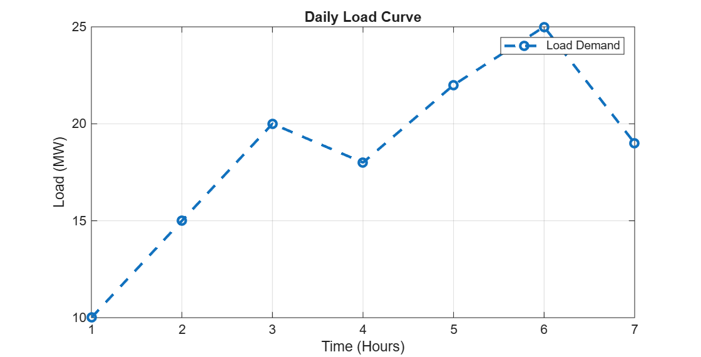

# Basic Power System Load Analysis using MATLAB

This mini project demonstrates the use of MATLAB fundamentals to analyze electrical load data in a simple power system scenario.

## Project Overview
- Load data analysis using vectors and matrices
- Calculation of total, average, and maximum load
- Overload detection using conditional statements
- Visualization of the daily load curve

## Sample Output

## Tools & Skills
- MATLAB
- Power Systems (Basics)
- Data Analysis
- Engineering Calculations
- Data Visualization

## About
This project was developed as part of self-learning and practical application after completing the MATLAB Onramp course.

## Author
Mohammed Omar  
Electrical Engineering Student – Power & Electrical Machines
